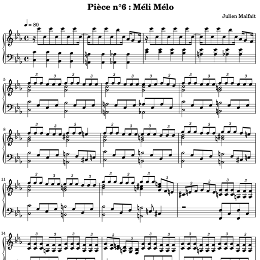

# Album Sniffance

L'idée de cet album est de créer une suite de pièces dans un style différent mais ayant une cohérence d'ensemble. Ce sont des mélodies qui me sont venues au fil du temps, depuis l'année 2007. Le travail du piano m'inspire parfois des bribes harmoniques ou rythmiques. Aussi je m'inspire de la musique que j'écoute en dilettante.

## La décomposition de l'album

Voici les 7 pièces :

| Pièce | Partition PDF  | Aperçu | Commentaire |
| ------------- | ------------- | ------------- | ------------- |
| 1 | [Tourbillon](01-Tourbillon.pdf) |  | Tout a commencé là, entre 2007 et 2012, finalisé en 2022 |
| 2 | [Envol](02-Envol.pdf) |  | Cet air est l'envol d'un oiseau, écrit en 2015 |
| 3 | [Fanie à cheval](03-Fanie.A.Cheval.pdf) |  | J'ai perdu ma petite soeur en 2018, cette pièce lui est dédiée. 2019 |
| 4 | [Bout du tunnel](04-Bout.Du.Tunnel.pdf) |  | Ambiance un peu liminale, qui n'est finalement pas une impasse. 2021 |
| 5 | [Lemniscate](05-Lemniscate.pdf) |  | Cette pièce à motif fixe pour la main gauche du début à la fin, d'inspiration électro, se nomme Lemniscate, le symbole de l'infini ∞. 2020 |
| 6 | [Méli-Mélo](06-Meli.Melo.pdf) |  | Cette pièce mélodique à 4 accords est un retour au calme, un entre-deux, un méli-mélo. 2021 |
| 7 | [Épilogue](07-Epilogue.pdf) |  | Conclusion musicale, dans une cohérence harmonique avec le reste. 2024 |

## Le pourquoi du Comment

La première pièce Tourbillon est en fait à la base 3 pièces séparées, que j'ai écrit entre 2007 et 2012. 2007 était l'année de mon mariage, et quelque part symboliquement l'année de concrétisation de beaucoup de choses. Étant diplômé de 2006, j'ai senti que ma vie était suffisamment posée pour me lancer dans la composition. Quelque part avant, je ne me sentais pas l'âme d'un compositeur. En tout cas je n'avais jamais eu cette envie. J'étais contraint par les études dans une logique de faire le minimum pour atteindre mon objectif, le diplôme ^^

Au début je ne voyais pas la connexion évidente entre les 3 pièces. Pourtant elles avaient la même tonalité. Bref. Si vous écoutez ce « Tourbillon », il y a partie 1, transition, partie 2, même transition, partie 3, encore même transition et finish. Les transitions et le finish ont été composés en 2022.

En 2015 alors que je n'avais pas composé depuis des années, j'ai eu cette inspiration de « Envol ». 2015 coïncide à la fin  de mon expatriation en Corée-du-Sud, l'année suivant mon divorce aussi. Cet air m'a été inspiré par le départ d'une amie à Paris. J'ai trouvé la partie de fin en 2022, qui donne un coté solennel et extrapolé à ce vol d'oiseau ^^

En 2019 j'ai commencé ce repository Github en me disant que après tout le code Lilypond se lit comme un code source, et Git permet de tracer les évolutions et modifications. J'ai créé Fanie à cheval en 2019, Lemniscate en 2020, et Bout du tunnel en fin 2021. Il m'a semblé que Bout du tunnel se place avant Lemniscate dans l'album car cela fait la transition entre la fin dramatique de « Fanie à cheval » et le coté électrique de Lemniscate.

En 2022 j'ai eu envie de créer un ensemble de pièces, mais il me manquait une unité. J'ai alors décidé de fusionner mes 3 anciennes pièces en une seule, Tourbillon. Ensuite chaque pièce avait une teinte particulière. Fanie à cheval est certainement la plus dramatique, mais cela m'a aidé à faire le deuil. Lemniscate est très énergique, et j'espère un jour en faire un vrai son électro. Quand je la joue, j'entends les différents instruments. Un jour, un jour :)
Méli-Mélo est la plus recherchée au niveau cohérence et mélodie. Épilogue, écrite en quelques heures en 2024, est très courte, mais cela termine merveilleusement bien cette série. Savoir finir est une chose contre-nature, car on a toujours l'envie de continuer. Toutefois cela apaise, donne un sentiment d'accomplissement, et donne aussi une unité à cet album daté 2024, Sniffance.

Ce nom rigolo, Sniffance, est un mix entre kiffance et snif, un mot privé que j'ai énormément utilisé avec Aleksandra, ma bae. Cet air Épilogue est aussi un épilogue de notre relation en 2024. Toute création est un reflet d'une réalité de l'auteur. Sniffance, représente la vie, dans ce mélange de lumière et d'obscurité. Les larmes peuvent être de bonheur ou de tristesse. Dans les 2 cas, on se sent vivre.

## Mon processus de composition

Avec le recul, il est facile de trouver des similitudes à chaque fois que je compose. Je pense à une mélodie ou une suite d'accords, ou bien juste un motif (octave de dos pour Lemniscate par exemple). Ensuite je joue des bribes, j'enregistre avec le voice recorder du tel. Puis je trouve un ordre, une structure globale de la pièce, puis je pose tout cela sur mon iPad dans une feuille SketchBook, avec un calque pour les portées et un calque pour les notes. Puis... j'utilise mon éditeur de code pour coder cela en langage [Lilypond](https://lilypond.org). J'aime l'idée que tout un morceau se résume en un fichier d'une centaine de lignes. C'est un pauvre fichier texte qui se compile en une partition hyper propre. Dans le même délire que [Latex](https://guides.nyu.edu/LaTeX/creating-document) pour générer des revues scientifiques. Bref tout cela pour dire que l'on n'a pas besoin d'un logiciel payant WYSIWYG pour produire une belle partition. Je partage tout ce code source sur GitHub, ici-même.

## Étape finale, enregistrer et faire un album Spotify

C'est cette dernière étape qu'il me reste à faire, une partie totalement floue et excitante à la fois.
